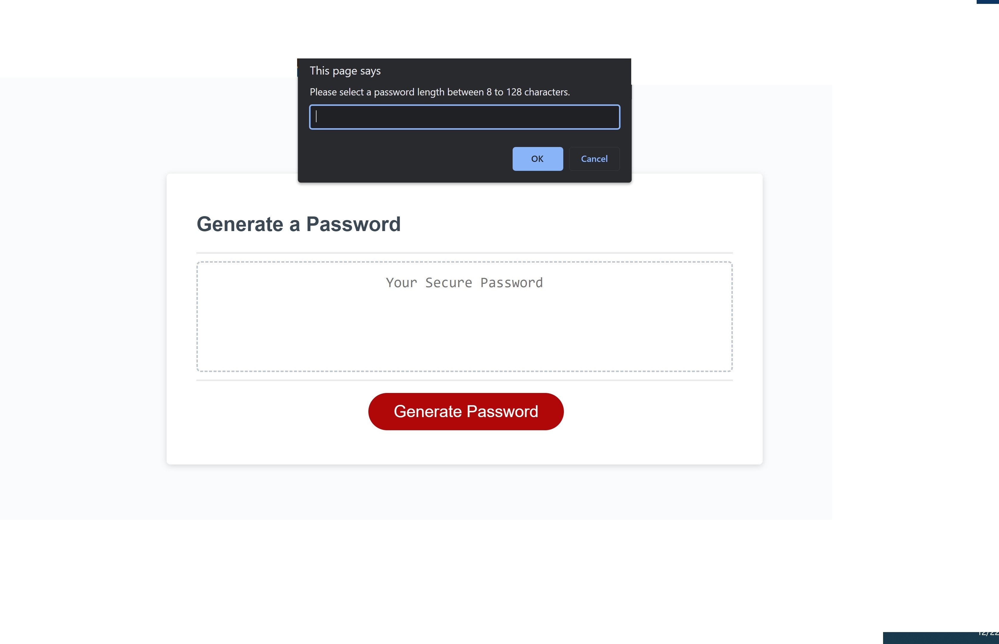

# unique-password-generator
This is the assignment for module 3 where you must JavaScript to create a random password generator for the user.

## Description
-This is the assignment for module 3 where you must JavaScript to create a random password generator for the user. 
-This generator makes the user select three out of the four criteria listed in order to generate a random password.
-Anything less than three selections alerts an error on the page and prompts the user to input again.
-Selecting a character length that is less than 8 or more than 128 alerts an error and loops to prompt the user to input a correct value again.

#Getting Started
This project has been deployed to GitHub Pages. To get this project up and running, you can follow the deployment link. Or, download the sources files to use this as a template.

##Installation
-To install the generator you must clone this repository to your local device via Bit Bash or the terminal. 
-Use the "cd" command to open into the new main branch and use the command "code ." to open VS Code.
-When the code opens, right click anywhere inside the index.html code and select "Open in Default Browser" and the application will spawn.

##Usage
-To use the generator, click "Generate Password" then follow the prompts.

-If all the prompts are followed correctly, then a random password will generate at the end.

-If the prompts are answered incorrectly, and error will alert, prompting you to try again.

##Credits

Starter code provided by the University of Minnesota.
Final version authored by Maria Juarez.

